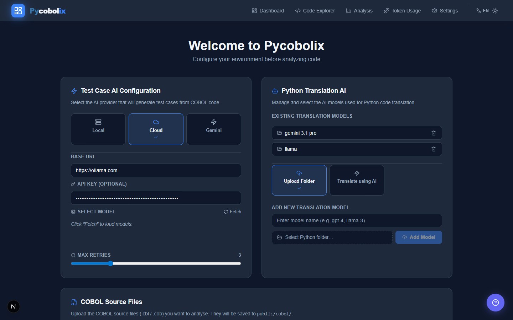
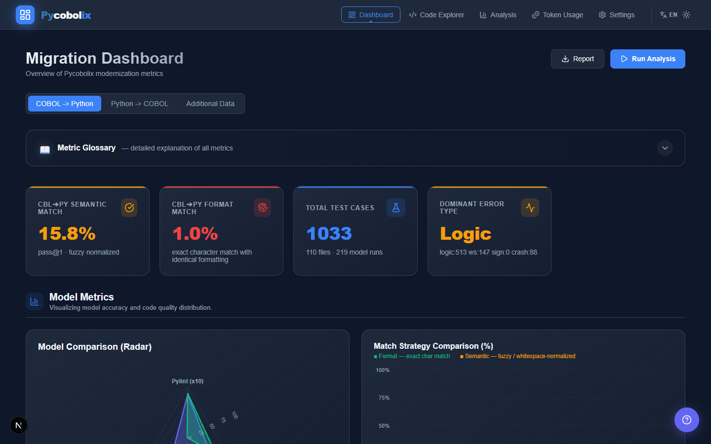
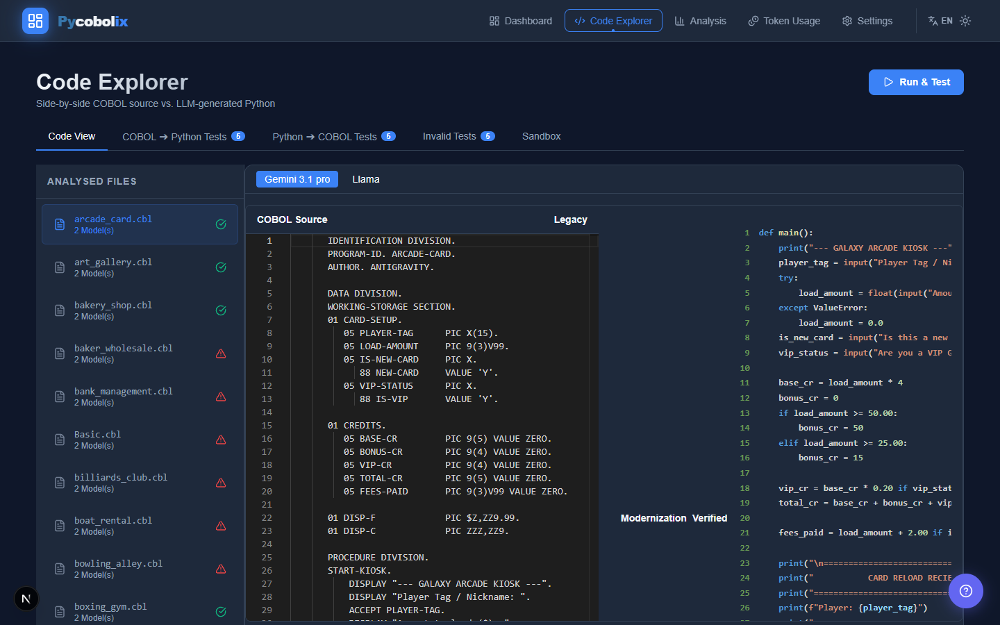
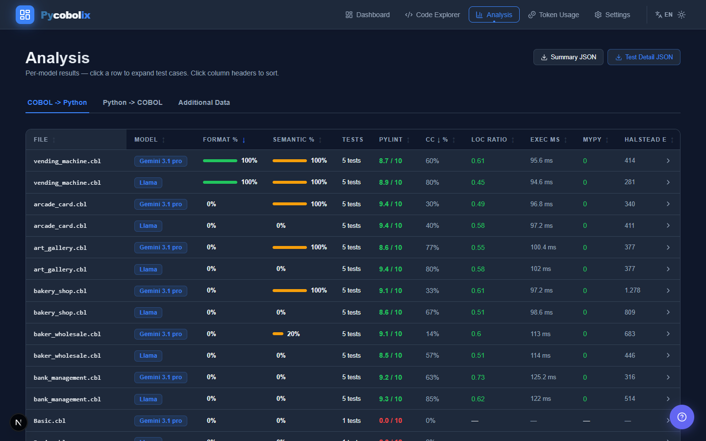

# 🐍 Pycobolix: Sıfır-Eğitimli (Zero-Shot) COBOL-Python Modernizasyon ve Test Çerçevesi

[](https://nextjs.org/)
[](LICENSE)
[](#)

Pycobolix, bankalarda ve kamu kurumlarında yaygın olarak kullanılan milyarlarca satırlık eski (legacy) **COBOL** kodunu, modern ve okunabilir **Python** koduna otomatik olarak dönüştürmek, test etmek ve doğrulamak için geliştirilmiş açık kaynaklı, web tabanlı bir framework'tür. 

Model ince ayarına (fine-tuning) ihtiyaç duymadan tamamen **sıfır-eğitimli (zero-shot)** bir yaklaşım sunar. Çevrilen kodun doğruluğu, izole edilmiş korumalı alanlarda (sandbox) otomatik olarak sınanır ve orijinal GnuCOBOL çıktılarıyla anlamsal (semantic) olarak karşılaştırılır.

---

## 📸 Kullanıcı Arayüzü (Web Dashboard)

Araştırmacıların ve geliştiricilerin çeviri süreçlerini, metrikleri ve test sonuçlarını anlık olarak takip edebilecekleri modern bir kontrol paneli sunulmaktadır.

| Ana Sayfa | Gösterge Paneli (Dashboard) |
|:---:|:---:|
|  |  |
| **Kod Gezgini (Explorer)** | **Metrik Analizi (Analysis)** |
|  |  |

*(Ayrıca model ayarları için `ui_settings.png` ve token kullanımı için `ui_token.png` sayfaları mevcuttur.)*

---

## ✨ Temel Özellikler

- **🤖 Sıfır-Eğitimli (Zero-Shot) Çeviri:** `COMP-3`, `REDEFINES`, `PERFORM VARYING` gibi karmaşık COBOL yapılarını model eğitimi gerektirmeden Python 3.11'e dönüştürür.
- **🛡️ Çift Yönlü Güvenli Korumalı Alan (Sandbox) Testi:** Orijinal COBOL kodunu GnuCOBOL ile, çevrilen Python kodunu ise Python 3.11 ile izole ortamlarda (sandbox) eşzamanlı olarak çalıştırır.
- **🧪 Hibrit Test Üretimi (BVA & LLM):** Kodların sınır değerlerini test etmek için Sınır Değer Analizi (Boundary Value Analysis - BVA) yöntemini kullanır. Yetersiz kaldığı durumlarda ise deterministik LLM çağrıları ile (*Temperature=0*) otomatik olarak her dosya için 5 farklı test senaryosu üretir.
- **📊 Gelişmiş Metrik Raporlama:** Anlamsal eşleşme (Semantic Match Rate), Pass@1, döngüsel karmaşıklık (Cyclomatic Complexity) düşüşü ve satır sayısı (LOC) analizi gibi detaylı akademik metrikler sunar.
- **🔒 Tam Veri Gizliliği Seçeneği:** Bulut tabanlı **Google Gemini 3.1 Pro** API'sine ek olarak, kurumsal güvenlik politikaları gereği kodlarını dışarı çıkaramayan kurumlar için yerel olarak barındırılan **Ollama (Meta Llama 3)** modelleriyle de çalışabilir.

---

## 🏗️ Mimari ve İş Akışı

Pycobolix'in mimarisi, kod üretiminin tahmin edilemezliğini güvenli test yürütmesinden ayırmak için iki ana ortama ayrılmıştır:

1. **Üretim Ortamı (Generation Environment):**
   - COBOL kaynak kodlarının sisteme alınması ve formatlanması.
   - LLM'ler aracılığıyla Python kodunun asenkron olarak üretilmesi (Zero-shot prompt engineering).
   - Test girdilerinin eşzamanlı olarak BVA ve LLM-fallback ile hazırlanması.
2. **Yürütme ve Değerlendirme Ortamı (Execution & Evaluation Environment):**
   - Üretilen test senaryolarının Python 3.11 ve GnuCOBOL için yaratılan güvenli Sandbox konteynerlerinde çalıştırılması.
   - Çıktıların anlamsal (semantic) eşleşme veya tam karakter uyumu (format match) kıstaslarına göre karşılaştırılması.
   - Hata tiplerinin (Mantık Hatası, Boşluk Hatası, Çökme) sınıflandırılması ve LLM aracılığıyla okunabilir bir PDF sonuç raporu (AI Summary) oluşturulması.

---

## 📈 Araştırma Sonuçları ve Başarı Oranları

Sistem, özel olarak hazırlanmış ve gerçek dünya senaryolarını yansıtan **110 dosyalık bir COBOL veri seti** üzerinde (Basit, Orta ve Karmaşık seviyelerde toplam $\approx$9,200 LOC) kapsamlı bir şekilde test edilmiştir.

### Temel Doğruluk Metrikleri
- **Gemini 3.1 Pro**, dosyaların **%37.3'ünde Anlamsal Eşleşme (Semantic Match)** başarısı gösterirken, Llama 3 8B sadece **%3.6** oranında başarılı olmuştur.
- **Pass@1 Oranı** (ilk denemede 5 testin 5'inden de geçme) Gemini için **%20.9**, Llama 3 için ise %0.9'dur.
- Dikkat çekici bir şekilde, test sürecini Python'dan COBOL'a (Reverse Translation) yürüttüğümüzde anlamsal eşleşme Gemini için **%43.6**'ya, Llama 3 için **%30.0**'a çıkmıştır. Bu, modellerin iş mantığını doğru kavradığını ancak çıktı formatında (ör. boşluk hizalamaları) COBOL ile uyuşmazlık yaşadığını göstermektedir.

### Kod Kalitesi ve Karmaşıklık Düşüşü
- Üretilen Python kodları orijinal COBOL'a kıyasla döngüsel karmaşıklığı (Cyclomatic Complexity) **Gemini ile %51.9**, **Llama 3 ile %63.9** oranında düşürmüştür.
- Satır sayısı oranları (LOC Ratio) sırasıyla **0.59 ve 0.53** olarak ölçülmüştür; yani Python versiyonları eski kodun yaklaşık yarısı uzunluğundadır.
- Kodlar üzerinde çalıştırılan \`mypy\` aracı **0 (sıfır) tip hatası** raporlamıştır.

### Performans ve Maliyet
Manuel olarak 180-200 saat sürecek olan 110 dosyalık çeviri ve analiz süreci, Pycobolix ile (çeviri, sandbox testleri ve PDF raporlama dâhil) yalnızca **50 dakika** içinde tamamlanmıştır.

---

## 🧪 Veri Seti

Açık kaynaklı ve karmaşık COBOL veri seti eksikliğini gidermek amacıyla bu araştırma kapsamında 110 dosyadan oluşan bir veri seti oluşturulmuştur. Programlar, McCabe'in döngüsel karmaşıklık hesabına ek olarak COBOL'un `PERFORM` ve `Paragraph` yapılarını da hesaba katan özel bir Karmaşıklık Skoru ($C$) ile "Basit", "Orta" ve "Karmaşık" olarak kategorize edilmiştir. Tüm veri setine `/article` dizininden veya projenin GitHub reposundan ulaşılabilir.

---

## 🚀 Başlangıç ve Kurulum

Projenin arayüzü ve backend API'leri **Next.js** kullanılarak geliştirilmiştir. Kurulum adımları aşağıdadır:

### Ön Koşullar
- Node.js (v18.x veya üzeri)
- npm, yarn, pnpm veya bun
- (İsteğe Bağlı) Yerel modeller için [Ollama](https://ollama.com/)
- (İsteğe Bağlı) Sandbox testleri için GnuCOBOL

### Kurulum Adımları

1. Depoyu bilgisayarınıza klonlayın:
   ```bash
   git clone https://github.com/berkkaya0304/pycobolix.git
   cd pycobolix
   ```

2. Gerekli kütüphaneleri yükleyin:
   ```bash
   npm install
   ```

3. Geliştirme sunucusunu başlatın:
   ```bash
   npm run dev
   ```

4. Tarayıcınızdan [http://localhost:3000](http://localhost:3000) adresine giderek Pycobolix Dashboard'a erişin.

---

## 📄 Lisans ve Akademik Atıf

Bu proje akademik bir araştırma kapsamında geliştirilmiş olup açık kaynaklıdır. Projeyi araştırmalarınızda veya kurumsal süreçlerinizde kullanacaksanız, lütfen ilgili makaleye atıfta bulunun (Atıf detayları makale yayınlandıktan sonra eklenecektir).

Geri bildirimleriniz, hata bildirimleri veya geliştirmeler için **GitHub Issues** ve **Pull Requests** sekmelerini kullanabilirsiniz!
